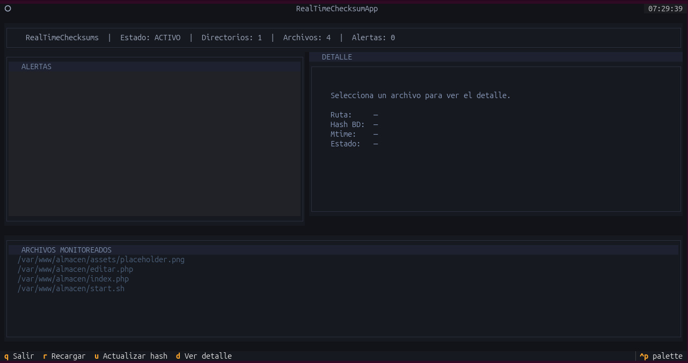

# RealTimeChecksums

A file integrity monitoring tool for Linux that detects unauthorized modifications, deletions, and new files in real time using `inotify` via `watchdog`. Built with a terminal UI powered by [Textual](https://github.com/Textualize/textual).



---

## Features

- Real-time detection of file modifications, deletions, and new files
- SHA-256 / BLAKE2b hashing engine
- SQLite integrity database with status tracking
- Terminal UI (TUI) with live alert feed and file browser
- Rotating log files (`info.log` and `alerts.log`)
- Desktop notifications via `notify-send`
- Blacklist support for system-managed files
- Maintenance mode (`--update`) to register legitimate changes
- Headless mode (`--no-ui`) for background monitoring

---

## Requirements

- Linux (uses `inotify`)
- Python 3.10+
- `notify-send` (usually pre-installed on most desktop environments)

---

## Installation

```bash
# Clone the repository
git clone https://github.com/yourusername/RealTimeChecksums.git
cd RealTimeChecksums

# Create and activate a virtual environment
python3 -m venv .venv
source .venv/bin/activate

# Install dependencies
pip install -r requirements.txt
```

---

## Usage

### Start monitoring (with TUI)
```bash
python3 main.py
```

### Monitor specific directories
```bash
python3 main.py --monitor /etc/ /var/www/html/
```

### Run in headless mode (no UI)
```bash
python3 main.py --no-ui
```

### Register a legitimate change
```bash
python3 main.py --update /path/to/file/or/directory
```

---

## Keyboard Shortcuts

| Key | Action         |
|-----|----------------|
| `q` | Quit           |
| `r` | Refresh list   |
| `u` | Update hash    |
| `d` | View detail    |

---

## Project Structure

```
RealTimeChecksums/
│
├── main.py                  # Entry point
├── config.py                # Global constants
├── requirements.txt         # Dependencies
│
├── core/
│   ├── hash_engine.py       # BLAKE2b / SHA-256 hashing
│   ├── db_manager.py        # SQLite operations
│   └── file_scanner.py      # inotify monitoring + directory scan
│
├── alerts/
│   ├── log_manager.py       # Rotating log files
│   └── notifier.py          # Desktop notifications
│
├── ui/
│   └── dashboard.py         # Textual TUI
│
└── data/
    ├── checksums.db          # Integrity database (generated)
    └── logs/
        ├── info.log
        └── alerts.log
```

---

## Default Monitored Directories

Defined in `config.py`:

```python
DEFAULT_MONITOR_PATH = ["/etc/", "/var/www/"]
```

Files excluded by default (system-managed):

```python
BL_FILES = ["/etc/mtab", "/etc/resolv.conf", "/etc/adjtime", "/etc/ld.so.cache"]
```

---

## License

MIT
